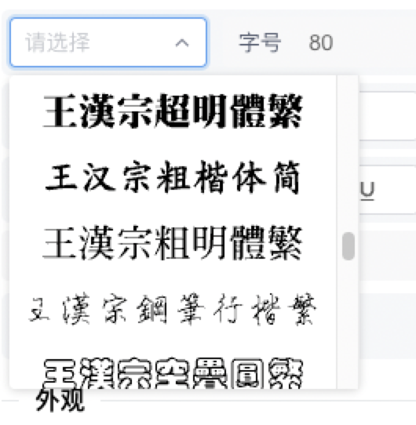
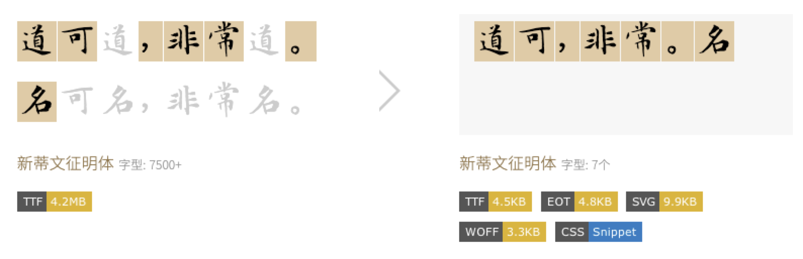

# 功能介绍

[咨询Pro付费版](https://wj.qq.com/s2/13937276/c127/)

## 字体素材管理

我们提供免费可商用的字体素材，您可以在后台中维护，也可添加您购买授权的字体文件。

我们可以根据字体文件生成对应的字体预览图片，只需通过调用SDK的API，即可获得在编辑器中展示的字体素材列表。

<figure><figcaption></figcaption></figure>

## 字体加载优化

中文字体从个数与样式上远远复杂于英文字体，精美的中文字体文件大都在几十兆左右。而在编辑器场景中往往只需要几个文字的字体，**加载几十兆的全量中文字体将是一个极差的体验**。

我们将字体优化功能集成在SDK中，可按需安文字加载中文字体，一个几十兆的字体文件，**按需加载后的字体文件只有几KB**。

<figure><figcaption></figcaption></figure>

## 分类素材管理

图片编辑应用中，只有丰富、专业素材库，才能让业务高效使用，我们可在后台中维护素材库，包括字体样式、图片、模板等各类素材，可通过SDK直接添加到画布。

